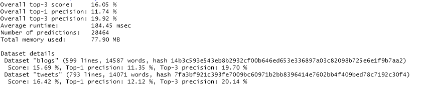

# Documentation 

  * **Author**: [Baptiste Maingret](bmaingret.github.io)
  * **Date**: February 2020
  * **Github repository**: [text-prediction-swiftkey](https://github.com/bmaingret/text-prediction-swiftkey.git )

This project is the final capstone for JHU Data Science course on Coursera.

## Goal
Build a Shiny app that takes a sequence of words as input and outputs the most likely next word.

## Method
We built a 5-grams model from a corpus based on blogs posts, news articles and tweets.

When given a word sequence we look for the 4-grams in our model and output the most common 3 next words.

If we don't find this 4-grams or don't have 3 possible predictions, we then recursively look for smaller n-grams up.

If we are still missing some predictions we complete with most common unigrams.

## Algorithm

### Preparation
0. Clean data (bad words removal, non word/ASCII removal, lowercase, etc.)
1. Generate the Term-Frequency matrices based on our corpus

### Prediction
0. Apply the same data cleaning process to the word sequence
1. Direct look-up for the next word candidates based on the input word sequence.
  a. If we don't find 5 results, we do the same with the input word sequence minus first word (we go from "a b c" lookup to "b c" lookup)

### References
- Large Language Models in Machine Translation, Brants et al, EMNLP/CoNLL 2007, (PDF)[https://www.aclweb.org/anthology/D07-1090.pdf]
- Next work prediction benchmark by [hfoffani](https://github.com/hfoffani), [Github repository](https://github.com/hfoffani/dsci-benchmark)
- Speech and Language Processing (3rd ed. draft), Jurafsky and H. Martin, [PDF](https://web.stanford.edu/~jurafsky/slp3/3.pdf)

## Benchmark

Here is a summary of the benchmark thanks to https://github.com/hfoffani/dsci-benchmark.

4. Next steps
========================================================
Here is a list of possible next steps (for each a proper evaluation should be conducted):
* Train with different datasets
* Add punctuations into the language model
* Replace least seen words by an UNKOWN token before n-gram generation
* Add begining and ending sentence tokens
* Optimize lookup when predicting